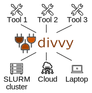

## What is `divvy`?

`Divvy` allows you to populate job submission scripts by integrating job-specific settings with separately configured computing environment settings. Divvy *makes software portable*, so users may easily toggle among any computing resource (laptop, cluster, cloud). 


## What makes `divvy` better?


Tools require a particular compute resource setup. For example, one pipeline requires SLURM, another requires AWS, and yet another just runs directly on your laptop. This makes it difficult to transfer to different environments. For tools that can run in multiple environments, each one must be configured separately.

<hr>


Instead, `divvy`-compatible tools can run on any computing resource. **Users configure their computing environment once, and all divvy-compatible tools will use this same configuration.**



Divvy reads a standard configuration file describing available compute resources and then uses a simple template system to write custom job submission scripts. Computing resources are organized as *compute packages*, which users select, populate with values, and build scripts for compute jobs. 

<br clear="all"/>

Use the default compute packages or [configure your own](configuration.md).  See what's available:

```{console}
divvy list
```

```{console}
Divvy config: divvy_config.yaml

docker
default
singularity_slurm
singularity
local
slurm
```


Divvy will take variables from a file or the command line, merge these with environment settings to create a specific job script. Write a submission script from the command line:

```{console}
divvy write --package slurm \
	--settings myjob.yaml \
	--compute sample=sample1 \
	--outfile submit_script.txt
```

### Python interface

You can also use `divvy` via python interface, or you can use it to make your own python tools divvy-compatible:

```{python}
import divvy
dcc = divvy.ComputingConfiguration()
dcc.activate_package("slurm")

# write out a submission script
dcc.write_script("test_script.sub", 
	{"code": "bowtie2 input.bam output.bam"})
```

For more details, check out the [tutorial](tutorial).
